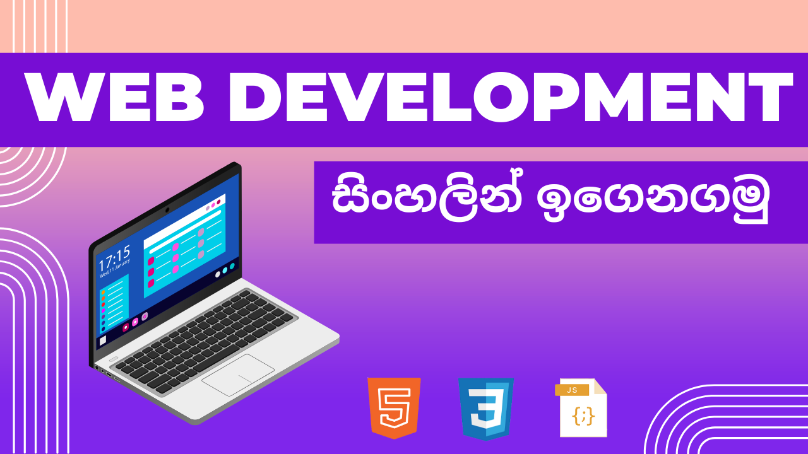

  

# 🌐 Web Development for Beginners  
## (HTML, CSS, JavaScript)

Welcome to my **Web Development for Beginners** course repository 🎉  
This repository contains **all source code, examples, and practice files** used in my **Technical Bro SL Web Development Course**.

## 📺 YouTube Course Link

▶️ **Watch the full course on YouTube:**  
*https://youtube.com/playlist?list=PLvOKyaVfOrKTTSAmz85bE5j7sQT2K_YS7&si=Bh7LiO4lHj8yStIA*

## 📚 What You Will Learn 

### ✅ English
By the end of this course, you will be able to:
- Understand how websites work
- Create web pages using **HTML**
- Style websites using **CSS**
- Add interactivity using **JavaScript**
- Link the website to database using **MYSql** and **PHP**
- Understand frontend and backend web development basics

# 🌐 වෙබ් අඩවි නිර්මාණය පිළිබද පදනම් පාඨමාලාව

මෙම GitHub repository එක තුළ **HTML, CSS, JavaScript** භාවිතා කරමින් මගේ **YouTube වෙබ් ඩිවලප්මෙන්ට් පාඨමාලාවට** අදාල සියලුම **code files, examples සහ projects** ඇතුළත් වේ.

මෙම පාඨමාලාව අවසන් වන විට ඔබට:
- Website එකක් ක්‍රියා කරන ආකාරය තේරුම් ගැනීම
- **HTML** භාවිතයෙන් web pages සාදීම
- **CSS** භාවිතයෙන් websites design කිරීම
- **JavaScript** භාවිතයෙන් websites interactive කිරීමට
- **MYSql** and **PHP** භාවිතා කර දත්ත පද්ධතියට සම්බන්ධ  කිරීම
- කුඩා real-world projects සාදීම
- Frontend and backend web development මූලික දැනුම ලබාගැනීමට හැකි වේ.

  ▶️ **සම්පූර්ණ පාඨමාලාව මෙතනින් නරඹන්න:**
*https://youtube.com/playlist?list=PLvOKyaVfOrKTTSAmz85bE5j7sQT2K_YS7&si=Bh7LiO4lHj8yStIA*
  

